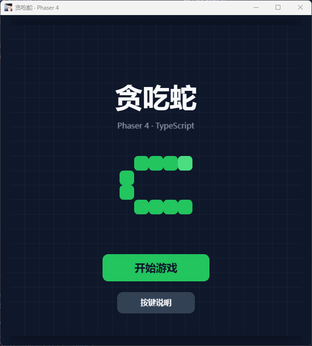
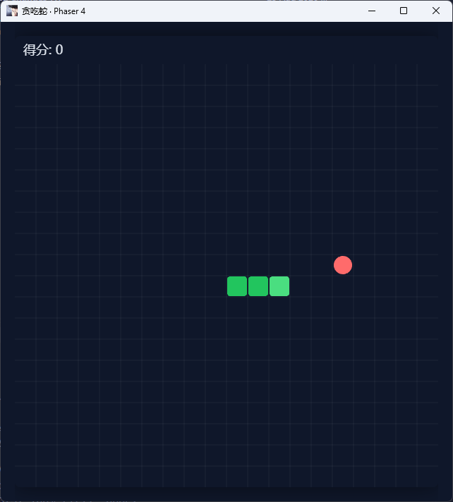
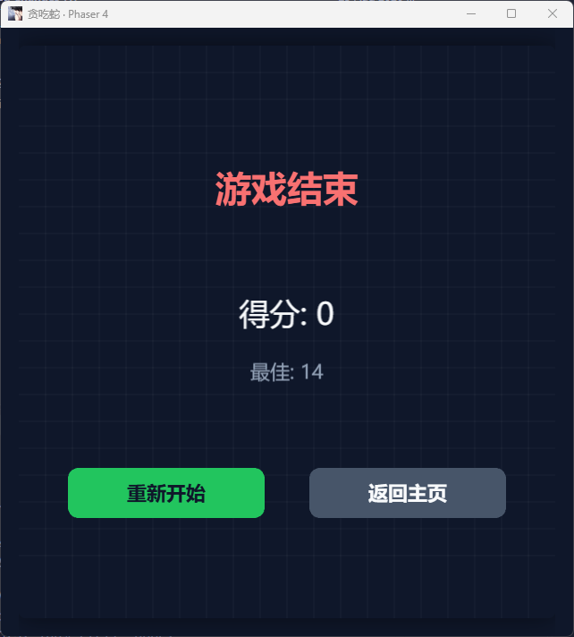

# 贪吃蛇 · Phaser 4 + TypeScript

基于 **Phaser 4** + **TypeScript** 的贪吃蛇游戏,**pnpm monorepo** + **Vite** + **Turborepo**。

<p align="center">
  
  
  
</p>

## 项目结构

```
apps/
├── game/        # Web 游戏(Vite + Phaser 4)
└── desktop/     # Electron 桌面壳(Windows)
packages/
├── config/      # 共享配置包:tsconfig / eslint-config / prettier-config
├── snake-core/  # 纯贪吃蛇逻辑(不依赖 Phaser,可独立复用)
└── snake-ui/    # Phaser UI 组件库(Button / Label / Panel / Modal / Toast)
```

核心玩法逻辑在 `@snake/core`,渲染与输入解耦;UI 组件在 `@snake/snake-ui`。

## 快速开始

```bash
pnpm install     # 安装依赖
pnpm dev         # 开发:Vite dev server → http://localhost:5173(同时拉起 Electron 桌面壳)
pnpm build       # 全仓生产构建
pnpm typecheck   # 全仓类型检查
pnpm lint        # 全仓 ESLint
pnpm format      # 全仓 Prettier 格式化
```

## 桌面端(Windows)

```bash
pnpm build:win   # 构建游戏 → electron-builder 打包
```

- 打包产物位于 `apps/desktop/release/`(NSIS 安装包 + portable 免安装版)
- 游戏构建由 `extraResources` 打进 `resources/game/`,主进程按 `app.isPackaged` 区分 dev / 生产加载
- 应用图标:`apps/desktop/assets/snakegame.png`

## 操作

| 按键 | 作用 |
| --- | --- |
| 方向键 / WASD | 控制方向 |
| 空格 / P | 暂停 / 继续 |

## 规则

- 吃食物 +1 分,蛇变长,速度随分数加快
- 撞墙或撞到自身 → 游戏结束;填满棋盘 → 通关胜利
